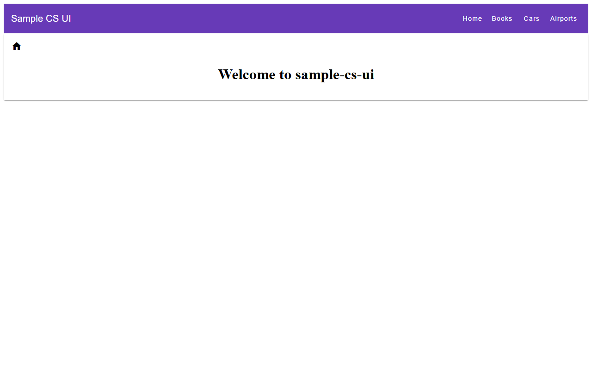
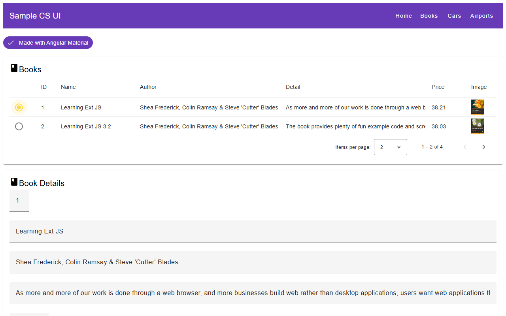
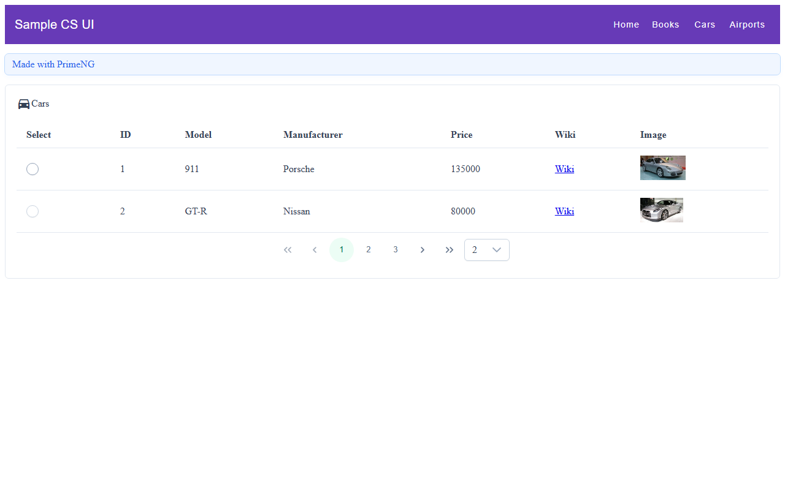
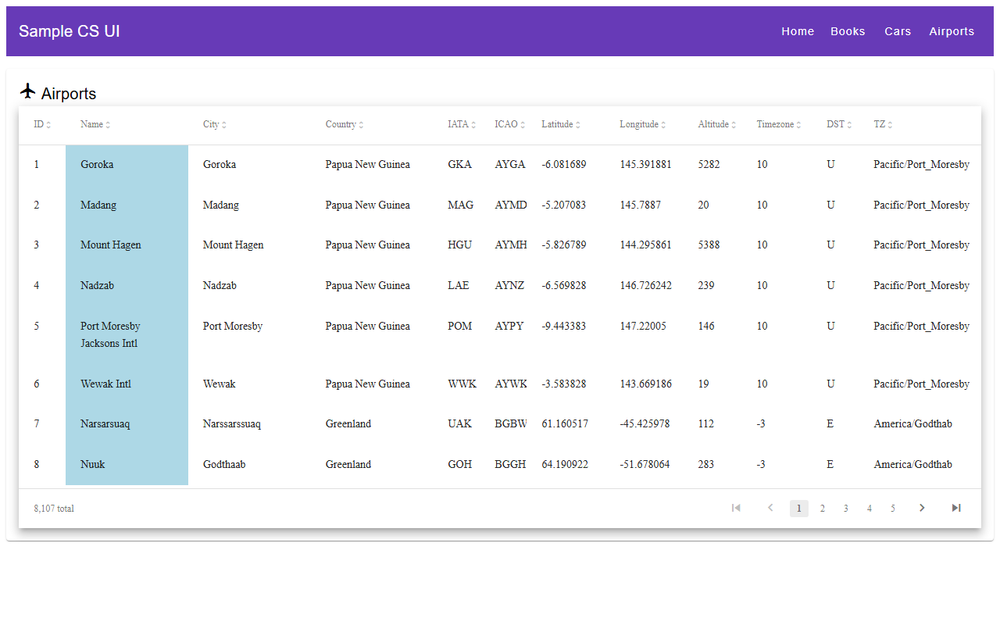

# sample-cs-ui

A sample Angular application demonstrating how to integrate a modern Angular stack — NgRx for state management, Angular Material and PrimeNG for UI components, and ngx-datatable for large data grids — in a single cohesive project.

## Stack

| Layer | Technology |
|---|---|
| Framework | [Angular 18](https://angular.dev) (standalone components) |
| State management | [NgRx 18](https://ngrx.io) — Store, Effects, Router Store, Devtools |
| UI components | [Angular Material 18](https://material.angular.io) + [PrimeNG 18](https://primeng.org) |
| Data grid | [@swimlane/ngx-datatable 20](https://swimlane.github.io/ngx-datatable/) |
| Logging | [ngx-logger 5](https://github.com/dbfannin/ngx-logger) |
| Node.js | 24.x |

## Screenshots

### Home


### Books — Angular Material paginated table


### Cars — PrimeNG paginated table


### Airports — ngx-datatable data grid


## Features

The app has four pages, each demonstrating a different UI approach backed by the same NgRx pattern (action → effect → reducer → selector):

| Page | UI library | What it shows |
|---|---|---|
| **Home** | Angular Material | Landing page with a Material card |
| **Books** | Angular Material | Paginated table (`mat-table`) with row selection via radio buttons |
| **Cars** | PrimeNG | Paginated table (`p-table`) and detail form (`p-panel`, `pInputText`) |
| **Airports** | ngx-datatable | High-performance data grid with sortable columns (8 107 rows) |

Navigation is handled through the NgRx router store: toolbar buttons dispatch `[Router] Go` actions rather than calling the Angular router directly.

## Project structure

```
src/app/
├── core/           # App-wide state: router actions, effects, custom router serializer
├── shared/         # Shared Angular module (currently thin, kept for extension)
├── home/           # Home page component
├── books/          # Books feature: component, list, details, NgRx state
│   └── state/      # actions, reducer, effects, state interface
├── cars/           # Cars feature: same structure as books
│   └── state/
├── airports/       # Airports feature: same structure, uses ngx-datatable
│   └── state/
└── testing/        # Shared mock data used in unit tests
```

## Prerequisites

- Node.js 24.x
- npm 10.x

## Getting started

```bash
npm install
npm start
```

The app runs at `http://localhost:4200`.

## Available scripts

| Command | Description |
|---|---|
| `npm start` | Dev server on port 4200 |
| `npm run build` | Production build into `dist/` |
| `npm run build:prod` | Alias for production build |
| `npm test` | Unit tests via Karma + Jasmine (watch mode) |
| `npm run test:ci` | Unit tests with coverage, headless Chrome, single run |
| `npm run lint` | ESLint over `src/**/*.ts` and `src/**/*.html` |
| `npm run lint:fix` | ESLint with auto-fix |

## State management

Each feature follows the same NgRx pattern:

```
Component  →  dispatch(action)
              ↓
           Effect  →  HTTP call  →  dispatch(successAction)
              ↓
           Reducer  →  new state
              ↓
           Selector  ←  Component subscribes
```

The router is also managed through the store via `@ngrx/router-store`. Navigation actions (`Go`, `Back`, `Forward`) are defined in `src/app/core/router.actions.ts` and handled by `RouterEffects`.

## Backend

There is no real backend. The services fetch JSON fixture files directly from `src/assets/data/` (`books.json`, `cars.json`, `airports.json`). To connect a real backend, update the URLs in `book.service.ts`, `car.service.ts`, and `airport.service.ts`.

## PrimeNG theming

PrimeNG 18 uses a programmatic theme system. The theme is configured in `src/main.ts` via `providePrimeNG()` with the `Aura` preset from `@primeng/themes`. To switch theme, replace `Aura` with another preset (`Lara`, `Nora`, `Material`) from the same package.

## Running tests

```bash
npm test          # interactive, browser opens automatically
npm run test:ci   # headless, outputs coverage to coverage/
```

Tests use Karma with ChromeHeadless. Mock data shared across tests lives in `src/app/testing/mockdata.ts`.
